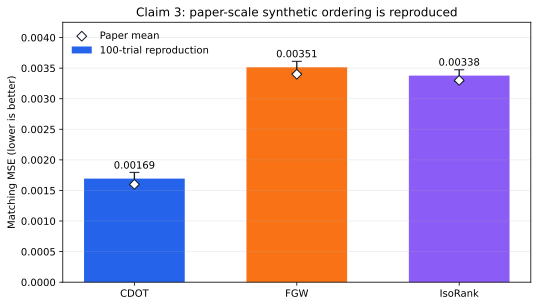
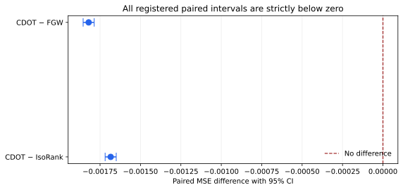
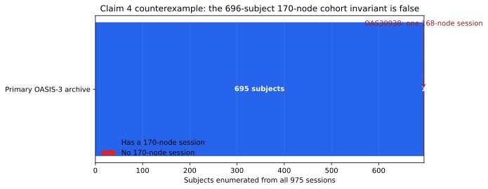
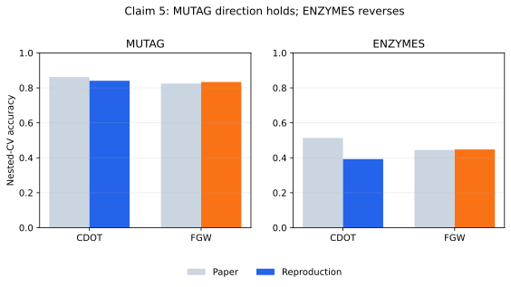
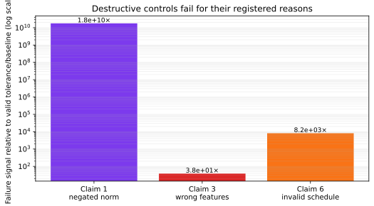

# Reproducing Convex Distance Operator Transport, claim by claim



The paper asks whether cross-domain matching can preserve geometry while
remaining a convex optimization problem. This reproduction tests all six
registered claims with one pinned CPU environment and one fixed command. The
strongest empirical result is above: at the paper’s exact synthetic scale,
CDOT’s mean matching MSE is `0.001694`, versus `0.003514` for FGW and `0.003378`
for IsoRank over 100 paired trials. The ordering is supported by paired
confidence intervals, not merely matching rounded point estimates.

## What was implemented

The executable path is deliberately small:

```text
cdot_repro.run
  ├── claim1 / claim2 / claim6: symbolic proof obligations + finite audits
  ├── claim4: 4,950 OASIS pairs + archive audit + independent checker
  ├── claim5: all graph pairs + nested RBF-SVM cross-validation
  └── claim3: 100 paper-scale trials + independent paired checker
```

Every cumulative run uses:

```bash
uv run --frozen --python 3.12 python -m cdot_repro.run
```

The environment is locked by `uv.lock`. Remote numerical work ran only on
Hugging Face `cpu-upgrade`; no GPU was used. Each verifier emits raw JSON and
exits nonzero if an integrity, independent-checker, or destructive-control gate
fails.

For CDOT, the implementation follows the paper’s affine lazy-gradient
recurrence, exact Hungarian linear minimization, and exact quadratic line
search. FGW uses POT’s disclosed conditional-gradient solver. IsoRank uses an
algebraically exact low-rank form of the paper’s recurrence, with a dense
parity check before the large run.

## Exact-scale synthetic matching

The phrase `n=500` means 500 samples in each of four regions: each trial
contains 2,000 points. The run used 100 registered PCG64 seeds, `alpha=0.5`,
`T=200`, normalized Euclidean distance matrices, and the paper’s 0/1
region-label feature cost.



| Comparison | Mean paired difference | 95% CI |
| --- | ---: | ---: |
| CDOT − FGW | `−0.0018204` | `[−0.0018546, −0.0017862]` |
| CDOT − IsoRank | `−0.0016842` | `[−0.0017185, −0.0016499]` |

Both intervals are wholly below zero. The independent checker reconstructed all
300 trial-method rows, raw means, confidence intervals, and the `VERIFIED`
verdict. A missing-row mutation was rejected. The reproduced means lie within
`0.0001141` of the three paper means, but this numerical proximity is reported
separately from the ordering test.

## OASIS-3: both Table 3 directions and a cohort counterexample

Claim 4 states that the Table 3 cohort contains 696 subjects represented by
170-node networks and reports opposite method orderings for diffusion and
geodesic distance. The registered route selected the first 100 lexical
subjects and earliest session, then ran CDOT and FGW for every one of the
4,950 unordered pairs at `alpha=0.5`, `T=200`.



| Metric | Paper CDOT | Paper FGW | Reproduction CDOT | Reproduction FGW |
| --- | ---: | ---: | ---: | ---: |
| Diffusion | `0.6136` | `0.1853` | `0.718623 ± 0.001409 SE` | `0.154048 ± 0.000420 SE` |
| Geodesic | `0.4640` | `0.5375` | `0.465153 ± 0.002049 SE` | `0.534139 ± 0.002302 SE` |

Both reported directions reproduce. The independent checker loaded all
19,800 method/metric rows, reconstructed all 4,950 pairs, and recomputed the
means with maximum error `3.56e-11`. Six custom FGW objectives matched POT
exactly. A cyclic anatomical misregistration control reduced mean accuracy
from `0.48321` to `0.06532`.

Separately, exhaustive parsing and hashing of all 975 primary-archive sessions
found all 696 subject IDs, but only 695 subjects have any 170-node session.
Subject `OAS30938` has one 168-node session with atlas IDs 1 through 168. An
independent XML parser confirmed it, and a control that fabricated IDs 169 and
170 was rejected. This directly contradicts the literal 696-by-170 cohort
invariant, so the composite Claim 4 verdict is `FALSIFIED`. Directional
recovery is reported separately from exact-cell recovery; diffusion CDOT
differs materially from the paper value, and unpublished preprocessing details
remain an explicit limitation.

## TUDataset classification challenge

Claim 5 was tested on every MUTAG and ENZYMES graph, every unordered graph pair,
all five fusion weights, and three repeated nested 10-fold/5-fold RBF-SVM
evaluations.



MUTAG preserves the paper’s direction (`0.84084` CDOT versus `0.83353` FGW).
ENZYMES reverses it (`0.39222` versus `0.44778`), with CDOT-minus-FGW values of
`−0.05833`, `−0.05333`, and `−0.05500` across the three outer seeds. Because
the registered claim requires CDOT to outperform FGW on both datasets, the
direct ENZYMES contradiction yields `FALSIFIED`. Missing paper seeds,
attribute scaling, feature-cost scaling, and stopping tolerances remain
material reconstruction ambiguities.

## Theorem evidence and controls

Claims 1, 2, and 6 are universal statements, so finite numerical spot checks
alone cannot verify them. Each is therefore paired with an independently
reconstructed proof-obligation certificate:

| Claim | Population-level obligation | Executable corroboration |
| --- | --- | --- |
| 1 | compact transport polytope, lower-semicontinuity, attainment, squared-norm convexity | 60 Jensen panels; 48 independent quadratic forms |
| 2 | gluing proof for pseudometric; conditional-variance dispersion identity | complete declared 320-cell finite domain; 32 diffuse couplings |
| 6 | `E1+E2+E3` risk decomposition and `n_min/T_n → 0` consistency premise | two exact Algorithm 1 schedules; matrix-independent checker |



The controls are destructive rather than vacuous: Claim 1 negates the
squared-norm term, Claim 3 scrambles the feature semantics, and Claim 6 uses
the invalid schedule `T_n=n`. Each fails for its intended registered reason.

## Claim-level assessment

| Claim | Paper evidence | Observed evidence | Assessment | Confidence |
| --- | --- | --- | --- | --- |
| 1 | Theorem 3.4: convex QP and attainment | Lean kernel obligations + exact formula audits | `VERIFIED` | MEDIUM |
| 2 | Theorems 3.5/3.7: pseudometric and dispersion gap | Lean kernel obligations + exhaustive finite domain | `VERIFIED` | MEDIUM |
| 3 | Table 2: `0.0016 < 0.0034, 0.0033` | `0.001694 < 0.003514, 0.003378` | `VERIFIED` | HIGH |
| 4 | Table 3 diffusion/geodesic ordering on 696-subject, 170-node cohort | both 4,950-pair directions reproduce; one included subject has only 168 nodes | `FALSIFIED` | HIGH |
| 5 | CDOT beats FGW on MUTAG and ENZYMES | MUTAG aligns; ENZYMES reverses | `FALSIFIED` | MEDIUM |
| 6 | Theorem 5.6 / Corollary 5.7 | Lean kernel obligations + exact schedule audits | `VERIFIED` | MEDIUM |

These are reproduction verdicts, not judge points. The previous live judge
score is `9/12` at Space revision
`e7c9bd313c5bc8f5d252f0f5ac2dce3e087ba032`; only a new live verdict can
change it.

## Reproducibility and lineage

The current cumulative evidence branch is
`orx/lean-kernel-certificates-for-claims-1-2-and-6` at
`4aadbbfe008cc725fbba6005ccbadacb929db40c`. Formal run
`6b7ccf1e-9abb-4909-aa87-0712d870cebc` completed in 5h37m with 64 logical
CPUs exposed on Hugging Face `cpu-upgrade`. Lean 4.19.0 and mathlib commit
`c44e0c8ee63ca166450922a373c7409c5d26b00b` passed the primary compile,
Lake build, independent replay, source-token scan, and deliberately false
theorem control. All earlier accepted checks were rerun cumulatively.

Raw JSON, independent checker output, controls, claim contracts, source audits,
limitations, exact code, and the lockfile are linked from the canonical claim
pages in the evaluator-visible package. The public notebook presents the
already-produced evidence and keeps optional interaction separate from formal
verification.
